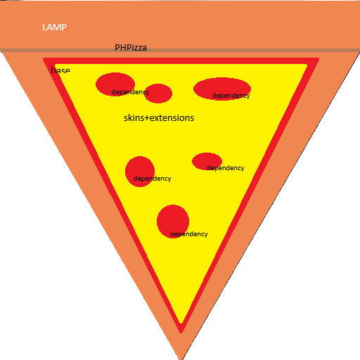

#  PHPizza
This is a CMS/app framework I have been working on for fun.

## Features
* Stores content and skin layouts in Markdown (just like how this README is stored in Markdown)
* Has multiskin functionality
* Supports the following DBMSes:
    - MariaDB
    - Oracle MySQL (DEPRECATED, use MariaDB instead)
    - Facebook MySQL
    - Percona Server
    - SQLite
    - PostgreSQL
* Supports PHP 8.2 and later
* Has a relatively simple database schema
* Has a placeholder in the schema for COPPA compliance

## License
Copyright (C) 2025 John Charles Woods

This program is free software: you can redistribute it and/or modify it under the terms of the GNU Affero General Public License as published by the Free Software Foundation, either version 3 of the License, or (at your option) any later version.

This program is distributed in the hope that it will be useful, but WITHOUT ANY WARRANTY; without even the implied warranty of MERCHANTABILITY or FITNESS FOR A PARTICULAR PURPOSE. See the GNU Affero General Public License for more details.

You should have received a copy of the GNU Affero General Public License along with this program. If not, see <https://www.gnu.org/licenses/>

### Extension and skin policy
* Extensions can be added to the CMS by unzipping their zip files into the `extensions` directory, the same goes for skins.
* All skins other than the PHPizza skin are not considered a part of PHPizza itself and are not derivative works.
* Extensions and skins must be compatible with the PHPizza and must not violate any laws or regulations.

### Why AGPL?
The AGPL is a copyleft license that requires any derivative work to be released under the same license. This means that if you modify the PHPizza, you must release your modified version under the AGPL. This is important because it ensures that the CMS remains open-source and that any modifications made by users are not restricted by copyright laws.

The AGPL was used as a license for this project since it prevents tivotization, which is the whole reason I built this CMS to replace WordPress.

## Installation
### Prerequisites
Software requirements:
* Debian 12 or later
* PHP 8.2 or later
* Any of the following DBMSes:
    - MariaDB
    - Oracle MySQL
    - Facebook MySQL
    - Percona Server
    - SQLite
    - PostgreSQL
* Any of the following webservers:
    - Apache httpd
    - NGINX
    - LightTPD

### Steps
1. Clone the repository:
```bash
git clone https://github.com/johnnycharlesw/phpizza.git /srv/cms/phpizza
```
2. Install the required dependencies:
```bash
cd /srv/cms/phpizza
composer install
```
3. Set the DocumentRoot to `/srv/cms` temporarily
4. [On the server, click here to start the installer!](https://localhost/phpizza/installer)
5. If you do not plan to use multiple CMSes on your server, set the DocumentRoot to `/srv/cms/phpizza` to put PHPizza at the web root
